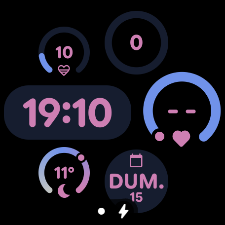
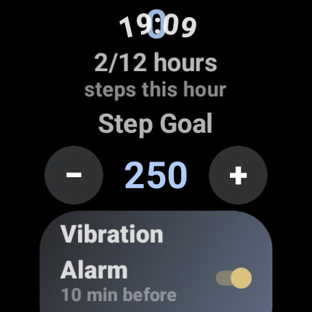
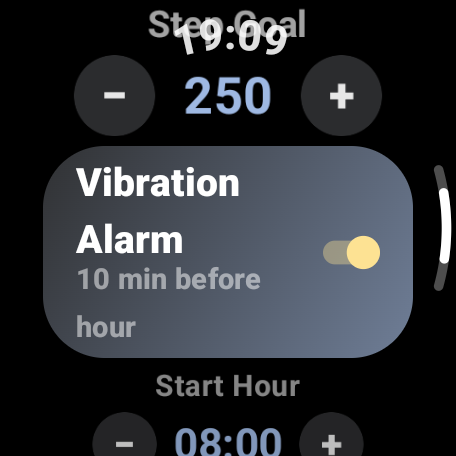
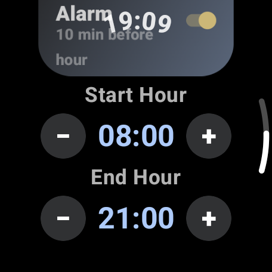

# MySteps

**Hourly step tracking with progress arc, vibration alerts, and configurable goals for Wear OS.**

## Screenshots

<p align="center">
  
  
  
  
</p>

## Why This App Exists

Google Fit and Google Health have **never provided hourly step count complications** despite years of user requests. MySteps fills this gap with a focused solution that tracks your steps per hour and keeps you moving throughout the day.

## Features

### Watch Face Complication
- **Progress arc** showing step completion toward your hourly goal
- **Heart icon** (❤) when goal is reached, with daily progress (e.g. `❤3/5` = 3 of 5 hours completed)
- **Real-time updates** every 2 seconds while screen is on
- **Smart tap**: opens settings when goal reached, refreshes step count when not

### Vibration Alarm
- **Vibrates 10 minutes before the hour** if step goal not reached
- **Dismiss** by pressing the crown button or tapping OK
- **Auto-stops** when you reach the goal or the hour changes
- **Toggle on/off** in settings

### Configurable Settings
- **Step goal**: adjustable in 50-step increments (default: 250)
- **Active interval**: start and end hour for tracking (default: 08:00 - 21:00)
- **Vibration alarm**: on/off toggle

### Hourly Progress Tracking
- Tracks how many hours you've met your step goal within your active interval
- Displayed on the complication (e.g. `❤3/5`) and in the app

## Requirements

- Wear OS 3.0+ (API 30)
- Step counter sensor

## Installation

```bash
./gradlew assembleDebug
adb install app/build/outputs/apk/debug/app-debug.apk
```

## Usage

1. Long-press your watch face → Customize → select a complication slot
2. Choose **"Hourly Steps"**
3. Open MySteps app to configure step goal, alarm, and active hours

## Architecture

```
com.example.mysteps/
├── complication/
│   ├── HourlyStepsComplicationService.kt   # RANGED_VALUE + SHORT_TEXT complication
│   ├── ComplicationTapReceiver.kt          # Smart tap handler
│   └── MainComplicationService.kt          # Day-of-week complication
├── service/
│   └── StepCounterService.kt              # Foreground service, sensor, alarm, screen tracking
├── presentation/
│   ├── MainActivity.kt                    # Settings UI (Compose)
│   ├── DismissAlarmActivity.kt            # Alarm dismiss screen
│   └── theme/Theme.kt
└── tile/
    └── MainTileService.kt
```

## License

This project is currently unlicensed. Please contact the author for usage permissions.
